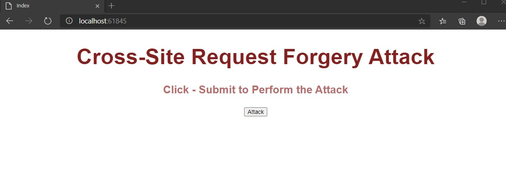
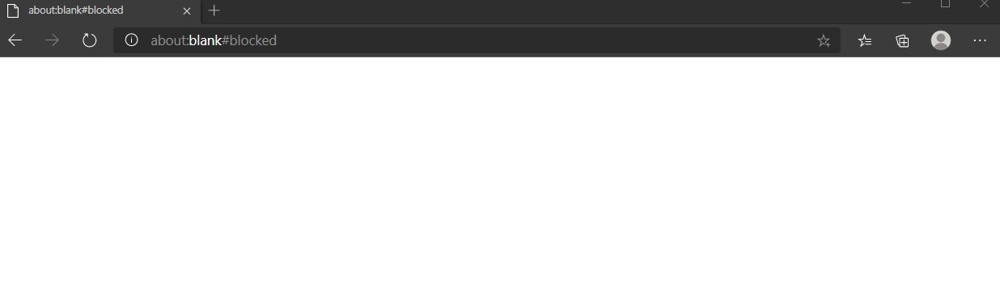

# Module 11: Managing Security

## Lab: Managing Security

1. **Nombres y apellidos:** Francisco Javier Moreno Quevedo
2. **Fecha:** 02/12/2020
3. **Resumen del Ejercicio:** implementarla seguridad en el proyecto 3/3
4. **Dificultad o problemas presentados y como se resolvieron:** Ninguna

Ejercicio 3: Avoid the Cross-Site Request Forgery Attack

- Creamos la carpeta controller y  añadimos el Home en el proyecto CrossSiteRequestForgeryAttack

- Creamos la vista index de este controlador

- añadimos el enlace a la hoja de estilos y el codigo del forgery attack

- Ejecutamos

  
  
  

- Evitamos el ataque de la siguiente manera

  - En la RegisterPost accion del accountcontroler colocamos la etiqueta  [ValidateAntiForgeryToken]
  - En la AddBookPost accion del Librariancontroler colocamos la etiqueta  [ValidateAntiForgeryToken]
  - En la LendingBookPost accion del LibraryController colocamos la etiqueta  [ValidateAntiForgeryToken]

  

